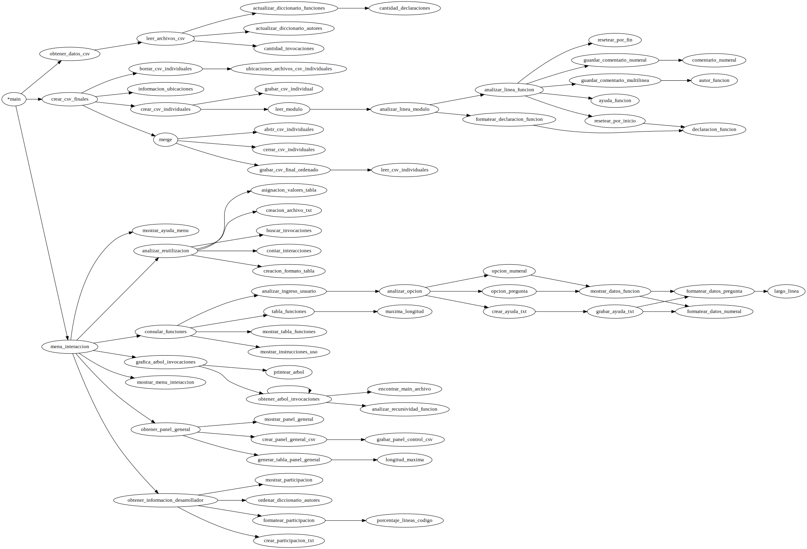

# Analizador Y Evaluador De Diseño Modular De Aplicaciones 

# Grupo Viborita

## Índice de Módulos
|  |  |  |
| --- | --- | --- |
| [main.py](#main)  | [m_panel_general_funciones.py](#Panel-General-de-Funciones)  | [m_consulta_funciones.py](#Consulta-de-Funciones)  |
| [m_analizador_reutilizacion_codigo.py](#Analizador-de-Reutilización-de-Código)  | [m_arbol_invocaciones.py](#Árbol-de-Invocaciones)  | [m_informacion_desarrollador.py](#Información-por-Desarrollador)  |
| [m_organizar_datos.py](#Organizar-Datos)  | [m_obtener.py](#Obtener)  | [m_grafo.py](#Grafo)  |
| [m_csv_finales.py](#Crear-CSV-Finales)  | [m_csv_individuales.py](#Crear-CSV-Individuales)  | [m_analizar_linea.py](#Analizar-Línea)  |

## [main](./main.py)

[*Indice*](#Índice-de-Módulos)

### Descripción
Se trata del módulo principal, en el se ejecuta el menu de interaccion que será utilizado por el usuario para acceder a la informacion que desee de la aplicación que se esta 
analizando.

### Funciones

#### main() 

*Autor: Andrés Kübler*

Es la funcion principal del modulo, llama a la funcion *crear_csv_finales(nombre_archivo)*  del módulo [*m_crear_csv_finales.py*](#Crear-CSV-Finales) que crea los archivos 
fuente_unico.csv y comentarios.csv, luego llama a la funcion 
*obtener_datos_csv(fuente, comentarios)*. Una vez que ya se tienen los datos, se llama a la funcion *menu_interaccion()* que valga la redundancia, ejecuta el menu de 
interacción.

#### obtener_datos_csv(*fuente, comentarios*)

*Autor: Ivan Litteri*

Abre los archivos fuente_unico.csv y comentarios.csv (nombres que le llegan por parámetro, en este caso el parámetro ```fuente``` corresponde a fuente_unico.csv y el parametro 
```comentarios``` corresponde a comentarios.csv), luego con los datos obtiene dos diccionarios, uno ordenado por funciones y otro ordenado por autores.
(se explicaran mas adelante) y los devuelve.

#### mostrar_menu_interaccion()

*Autor: Ivan Litteri*

Muestra en pantalla el título de la aplicacion y las opciones que tiene para elegir el usuario.

#### mostrar_ayuda_menu(*opcion*)

*Autor: Ivan Litteri*

Muestra en pantalla una breve descripcion de lo que se trata cada opción del menú.

#### menu_interaccion(*datos_por_funciones, datos_por_autores*)

*Autor: Andrés Kübler*

Muestra en pantalla el menu llamando a la funcion *mostrar_menu_interaccion()*, luego se queda en espera al ingreso del usuario, en donde éste tiene entre 6 opciones para elegir
entre ellas se encuentran:

1. [Panel General de Funciones](#Panel-General-de-Funciones)
2. [Consulta de Funciones](#Consulta-de-Funciones)
3. [Analizar Reutilizacion de Código](#Analizador-de-Reutilización-de-Código)
4. [Árbol de Invocaciones](#Árbol-de-Invocaciones)
5. [Información por Desarrollador](#Información-por-Desarrollador)
6. Ayuda

Las primeras 5 se tratan de la obtención de la información correspondiente a cada punto del trabajo práctico, y la sexta opción es la que muestra en pantalla las instrucciones
de uso del menú. Internamente llama a la función *mostrar_ayuda_menu()*.

El usuario debe ingresar por teclado una de las opciones en pantalla, en caso de que ingrese una opción no disponible, se le informa y pregunta denuevo. Cada opción llama a su
función correspondiente.

```datos_por_funcion``` y ```datos_por_autor``` corresponden a los datos obtenidos anteriormente con la funcion *obtener_datos_csv(fuente, comentarios)*

Para salir del menú de opciones se debe presionar ENTER.


## [Crear CSV Finales](./m_csv_finales.py)

[*Indice*](#Índice-de-Módulos)

### Descripción
Obtiene informacion del archivo "programas.txt" que usa para crear un archivo csv individual para cada una de las ubicaciones, hace un merge de esos archivos y luego los borra.

### Funciones

#### crear_csv_finales(*nombre_archivo*)

*Autor: Ivan Litteri*

Ejecuta en orden funciones para crear los archivos csv finales. Primero consigue la información de las ubicaciones de los códigos que se encuentran en el archivo de 
programas.txt llamando a la funcion *informacion_ubicaciones(nombre_archivos)* del módulo [*m_obtener.py*](#Obtener) a la que le pasa el parámetro ```nombre_archivo``` que en 
este caso se trata de el archivo "programas.txt".

La información de las ubicaciones se la pasa a otra función que llama, *crear_csv_individuales(info_ubicaciones)* del módulo [*m_csv_individuales.py*](#Crear-CSV-Individuales) 
que ademas de crear los archivos fuente y comentarios csv para cada una de las ubicaciones halladas devuelve una lista con los nombres de esos archivos csv creados que los usa 
luego cuando llama a la función *merge(nombre_archivo_final, archivos_individuales, lineas_fuera_funcion)*.

Luego de hacer el merge para cada uno de los archivos csv finales borra los archivos csv individuales provisorios antes creados con la funcion 
*borrar_csv_individuales(nombres_archivos_csv_individuales)*.

#### borrar_csv_individuales(*nombres_archivos_csv_individuales*)

*Autor: Ivan Litteri*

Borra los archivos fuente y comentarios csv individuales (que se encuentran en el repositorio actual) cuyas ubicaciones se obtienen de una lista que devuelve la funcion 
*ubicaciones_archivos_csv_individuales(nombres_archivos_csv_individuales)* del módulo [*m_obtener.py*](#Obtener) a la que le llega por parametro 
```nombres_archivos_csv_individuales``` que corresponde a una lista con los nombres de los archivos csv individuales (tanto fuente como comentarios).

#### merge(*nombre_archivo_final, archivos_individuales, lineas_fuera_funcion*)

*Autor: Luciano Federico Aguilera*

```nombre_archivo_final``` es el nombre del archivo csv final que se quiere crear, ```archivos_individuales``` es una lista con los nombres de los archivos individuales a
abrir, ```lineas_fuera_funcion``` es una lista con las lineas que estan afuera de funciones.

Abre los archivos "n" individuales y el archivo final, graba en forma ordenada las lineas de los individuales en el archivo final y cierra todos los archivos abiertos

#### abrir_csv_individuales(*archivos*)

*Autor: Ivan Litteri*

```archivos``` es una lista con los archivos que se tienen que abrir

Se guardan los datos a leer de los archivos individuales en un diccionario ya que la unica forma que encontramos de guardar variables dinámicas fue de esta forma, entonces 
se pueden tener abiertos "n" archivos. Y devuelve un diccionario con el contenido de cada módulo como value de la key (que seria el módulo). Ya que el open devuelve un
objeto de un tipo especial al que luego se le pueden aplicar métodos como *readline()*, etc., guardamos esos objetos como values en un diccionario.

Devuelve ```diccionario_archivos_abiertos``` que es un diccionario que contiene el contenido de todos los archivos csv individuales involucrados.

#### grabar_csv_final_ordenado(*archivo_final, archivos_individuales, lineas_fuera_funcion*)

*Autor: Luciano Federico Aguilera*

```archivo_final``` es el nombre del archivo csv final que se quiere grabar, ```archivos_individuales``` es el diccionario que tiene el contenido de todos los archivos csv
individuales, ```lineas_fuera_funcion``` es la lista que contiene las lineas de codigo que estan fuera de funciones.

Lee las lineas de los archivos individuales, las compara, y graba de forma ordenada alfabeticamente por funcion el archivo final.

Primero obtiene una lista de lineas de todos los archivos individuales de la función *leer_csv_individuales(archivos_individuales)*, se obtiene la menor de ellas, luego
se recorre la lista y se encuentra la menor, cuando ocurre esto se graba esa linea en el ```archivo_final``` y se elimina de la lista esa linea, y asi sucesivamente
con cada linea hasta que ya no hay mas en la lista.

#### leer_csv_individuales(*datos*)

*Autor: Luciano Federico Aguilera*

```datos``` es el diccionario que tiene el contenido de los archivos individuales.

Lee secuencialmente cada archivo y almacena las lineas leidas en una lista. Recorriendo key por key el diccionario y leyendo linea por linea
hasta que no hay mas lineas por leer en cada archivo.

Devuelve ```lineas``` que es la lista de todas las lineas de todos los archivos csv individuales.

#### cerrar_csv_individuales(*datos*)

*Autor: Ivan Litteri*

```datos``` es el diccionario que tiene el contenido de los archivos individuales.

Cierra cada uno de los archivos individuales.

## [Organizar Datos](./m_organizar_datos.py)

[*Indice*](#Índice-de-Módulos)

### Descripción

Lee los archivos fuente_unico.csv y comentarios.csv secuencialmente, los procesa y con los datos extraidos de cada una de las lineas lo guarda en un diccionario.

### Funciones

#### leer_archivos_csv(*archivo_fuente, archivo_comentarios*)

*Autor: Ivan Litteri*

```archivo_fuente``` es el contenido del archivo fuente_unico.csv a leer

```archivo_comentarios``` es el contenido del archivo comentarios.csv a leer

Recibe los contenidos de los archivos csv finales, y devuelve dos diccionarios, uno ordenado por funciones y otro ordenado por autores. Primero carga la primera linea de ambos 
archivos, y mientras haya lineas para leer de los archivos, formatea la linea, y envia los datos extraidos a dos funciones distintas, una 
*actualizar_diccionario_funciones(datos_por_funciones, nombre_funcion, parametros_funcion, modulo_funcion, lineas_funcion, autor_funcion, ayuda_funcion, otros_c, indice_copia)* 
y *actualizar_diccionario_autores(datos_por_autores, nombre_funcion, lineas_funcion, autor_funcion, indice_copia)* que va actualizando los diccionarios linea a linea. Luego una 
vez que termina el recorrido, llama a la funcion *cantidad_invocaciones(datos_por_funciones, archivo_fuente)* del módulo [*m_obtener.py*](#Obtener) que le agrega las 
invocaciones. La información de la linea podia ser extraida en cada una de las funciones que actualiza el diciconario pero, para no hacer el doble de recorridos sacrificamos 
tener pocos parametros para hacer la mitad de recorridos.

#### actualizar_diccionario_funciones(*datos_por_funciones, nombre_funcion, parametros_funcion, modulo_funcion, lineas_funcion, autor_funcion, ayuda_funcion, otros_c, indice_copia*)

*Autor: Ivan Litteri*

```datos_por_funciones``` es el diccionario por funciones a actualizar, 

```nombre_funcion``` es el primer campo de la linea leida en el csv, 

```parametros_funcion``` es el segundo campo de la linea leida en el csv, 

```lineas_funcion``` es la lista de lineas que corresponde a todos los campos de la linea desde el cuarto hasta el ultimo en caso de que haya, 

```autor_funcion``` es el segundo campo de la linea de comentarios.csv y corresponde al autor de la función, 

```otros_c``` es una lista con los comentarios que no corresponden a ayuda de función y autor  de función, 

```indice_copia``` es un indice que se incrementa si existen funciones con nomrbes repetidos, entonces se agrega "_indice_" a esa función repetida.

Actualiza y da formato al diccionario ordenado por funciones, cada key del diccionario es una funcion, el value de cada key es otro diccionario con todos los datos relativos a 
esa funcion, entre ellos, "_parametros_" cuyo value es un string; "_modulo_" al que pertenece, cuyo value es un string; "_lineas_" de esa funcion, cuya value es una lista de 
lineas; "_invocaciones_", cuyo value es una lista con las invocaciones que realiza esa funcion; "_cantidad de lineas_" cuyo value es un entero, "_cantidad de invocaciones_", 
cuyo value es un entero y corresponde a la cantidad de veces que es invocada esa función; "_comentarios_" que su value es otro diccionario que contiene 3 keys: "_ayuda_" que 
contiene la ayuda de la función en caso de tenerla, sino contiene None; "_autor_" que contiene al autor de la función en caso de haberlo, sino contiene None; y "_otros_" que 
contiene una lista de comentarios extra en caso de haberlos; y "_cantidad declaraciones_" es la ultima key del diccionario que contiene cada función cuyo value corresponde a 
otro diccionario que contiene las cantidades de declaraciones de esa funcion (que corresponden al punto 1), las cuales son obtenidas por la función 
*cantidad_declaraciones(datos_por_funciones, lineas_funcion, nombre_funcion)* del módulo [*m_obtener.py*](#Obtener).

```
diccionario = {"funcion_1": {"parametros": (str),
                             "modulo": (str),
                             "lineas": (lista),
                             "invocaciones": (lista),
                             "cantidad_lineas": (int),
                             "cantidad_invocaciones": (int),
                             "comentarios": {"ayuda": (str),
                                             "autor": (str),
                                             "otros": (str)
					     }
                             "cantidad_decalraciones": {"returns": (int)
                                                        "if/elif": (int)
                                                        "for": (int)
                                                        "while": (int)
                                                        "break": (int)
                                                        "exit": (int)
                                                        "coment": (int),
							},
                                                       
             "funcion_2": {...},
             "funcion_n": {...}
	      }
```

#### actualizar_diccionario_autores(*datos_por_autores, nombre_funcion, lineas_funcion, autor_funcion, indice_copia*)

*Autor: Ivan Litteri*

```datos_por_autores``` es el diccionario por autores a actualizar, 

```nombre_funcion``` es el primer campo de la linea leida en el csv,

```lineas_funcion``` es la lista de lineas que corresponde a todos los campos de la linea desde el cuarto hasta el ultimo en caso de que haya, 

```autor_funcion``` es el segundo campo de la linea de comentarios.csv y corresponde al autor de la función,

```indice_copia``` es un indice que se incrementa si existen funciones con nomrbes repetidos, entonces se agrega "_indice_" a esa función repetida.

Actualiza y da formato al diccionario ordenado por autores, cada key del diccionario es un autor, y el value de esa key es un diccionario que contiene dos keys, "_funcion_" y 
"_lineas totales_", en donde el primero corresponde a la cantidad de lineas que tiene esa funcion, y el segundo incrementa en cada pasada las lineas de todas las funciones. 
Entonces el diccionario queda con la forma:

```
diccionario = {"autor_1": {"funciones": {"funcion_1": (int),
                                         "funcion_2": (int),
                                         "funcion_n": (int),
                                        },
                            "lineas_totales": (int)
                                                
             "autor_2": {...},
             "autor_n": {...}
	      }
```

## [Panel General de Funciones](./m_panel_general_funciones.py)

[*Indice*](#Índice-de-Módulos)

### Descripción 

Obtiene una lista de columnas y una lista de longitudes de la funcion ```generar_tabla_panel_general(diccionario)```. La lista de columnas se deriva a la funcion 
```crear_panel_general_csv(lista_de_columnas)``` y tambien deriva junto a la lista de longitudes a la funcion ``` mostrar_panel_general(lista_de_columnas, longitud)```, las 
cuales crean el archivo csv solicitado y muestran la tabla formateada con esos datos.

### Funciones

#### mostrar_panel_general(lista_de_columnas, longitud)

*Autor: Santiago Vaccarelli*

```lista_de_columnas```  es una lista de columnas creada a partir del diccionario con los datos de las funciones con un formato conveniente para realizar el punto.

```longitud``` es una lista con los valores de las longitudes maximas de cada columna de la tabla.

Itera sobre los elementos de cada columna de la lista de columnas y va mostranda en pantalla cada fila de la tabla formateada como se indica.

#### grabar_panel_control_csv(archivo, lineas)

*Autor: Santiago Vaccarelli*

```archivo``` es el archivo csv que se va a grabar.

```lineas``` es una lista de lineas a ser grabadas en el archivo csv.

Graba las lineas que le llegan por parametro al archivo.

#### crear_panel_general_csv(lista_de_listas)

*Autor: Santiago Vaccarelli*

```lista_de_columnas```  es una lista de listas creada a partir del diccionario con los datos de las funciones con un formato conveniente para realizar el punto.

Crea el archivo csv del panel general e invoca a la funcion que lo graba ```grabar_panel_control_csv(archivo, lineas)```

#### generar_tabla_panel_general(diccionario)

*Autor: Santiago Vaccarelli*

```diccionario``` es un diccionario con los datos necesarios de las funciones.

A partir de un diccionario con datos de las funciones crea una lista donde cada lista es toda la informacion necesaria de una funcion y una lista de longitudes maximas para cada indice de las lista

#### obtener_panel_general(dict_pricipal)

*Autor: Santiago Vaccarelli*

```dict_principal``` Es un diccionario con los datos de las funciones.

Invoca a las funciones, ```generar_tabla_panel_general(dict_principal)```, ```crear_panel_general_csv(lista_de_columnas)``` y ``` mostrar_panel_general(lista_de_columnas, longitud)```
Esta funcion es la que sera llamada en el [main.py](#main).


## [Consulta de Funciones](./m_consulta_funciones.py)

[*Indice*](#Índice-de-Módulos)

### Descripción

Lee el diccionario de datos por funcion, ordena las funciones por orden alfabético, imprime la tabla con las funciones de la aplicación, y se queda esperando a que el usuario 
interactue, y muestra o imprime la informacion solicitada por éste.

### Funciones

#### consultar_funciones(datos_csv)

*Autor: Joel Glauber*

```datos_csv``` es el diccionario organizado por funciones con los datos de los archivos csv finales.

Guarda en la variable "_lista de funciones_" la lista ordenada alfabéticamente de los nombres de las funciones de la aplicación, para enviarla por parámetro a la funcion 
*tabla_funciones* del módulo [*m_obtener.py*](#Obtener) que devuelve dos cadenas, una que corresponde a la tabla a mostrar y otra que corresponde a la cantidad de guiones, 
cadenas que se envían como parámetro a la función *mostrar_tabla_funciones(tabla, cantidad_guiones)*, luego llama a la función *mostrar_instrucciones_uso()* y la función 
*analizar_ingreso_usuario(datos_csv)*

#### mostrar_instrucciones_uso()

*Autor: Ivan Litteri*

Imprime las instrucciones de uso del módulo

#### mostrar_tabla_funciones(*tabla, cantidad_guiones*)

*Autor: Joel Glauber*

```tabla``` es un string que contiene la tabla formateada

```cantidad_guiones``` es un string que contiene guiones.

Muestra en pantalla la tabla de funciones que conforman a la aplicación.

#### solicitar_ingreso_usuario(*datos_csv*)

*Autor: Joel Glauber*

```datos_csv``` es el diccionario organizado por funciones con los datos de los archivos csv finales.

Solicita el ingreso de una cadena, que tiene que ver con las opciones que se le mostraron previamente en pantalla, opción que luego es analizada por al función 
*analizar_opcion(datos_csv, opcion)*.

#### analizar_opcion(*datos_csv, opcion*)

*Autor: Joel Glauber*

```datos_csv``` es el diccionario organizado por funciones con los datos de los archivos csv finales.

```opcion``` es la cadena que corresponde a la opcion ingresada por el usuario.

Analiza la opción con distintas interrogaciones, si el primer caracter de la opcion corresponde a un "_#_" y ademas no es el único caracter que compone a la cadena, entonces se 
deriva a la función *opcion_numeral(datos_csv, opcion)*; si el primer caracter de la opción corresponde a un "_?_" y además no es el único caracter que compone la cadena, 
entonces se deriva a la función *opcion_pregunta(datos_csv, opcion)*; si la opción es igual a "_imprimir ?todo_" se deriva a la función *crear_ayuda_txt(datos_csv, opcion)* 
donde continúa su análisis; si la opción es igual a "_imprimir #todo_" se deriva a la función *crear_ayuda_txt(datos_csv, opcion)* donde continúa su análisis; y si la función 
pasa estas interrogaciones entonces le informa al usuario que la opción que ingreso es incorrecta y le pregunta denuevo.

#### opcion_numeral(*datos_csv, opcion*)

*Autor: Joel Glauber*

```datos_csv``` es el diccionario organizado por funciones con los datos de los archivos csv finales.

```opcion``` es la cadena que corresponde a la opcion ingresada por el usuario.

Analiza la opción con distintas interrogaciones, si la opción es igual a "_#todo_" entonces deriva a la función *mostrar_datos_funcion(datos_csv, funcion, opcion)* y le pasa con 
un iterador todas las funciones que se encuentran en la tabla; si el contenido de la opcion desde el numeral hasta que termina (matematicamente (#; +oo) seria el numeral sin 
incluir) corresponde a una de las funciones existentes en la tabla, entonces deriva a la función *mostrar_datos_funcion(datos_csv, funcion, opcion)*; si pasa estas 
interrogaciones entonces le informa al usuario que la opción que ingreso es incorrecta y le pregunta denuevo.

#### opcion_pregunta(*datos_csv, opcion*)

*Autor: Joel Glauber*

```datos_csv``` es el diccionario organizado por funciones con los datos de los archivos csv finales.

```opcion``` es la cadena que corresponde a la opcion ingresada por el usuario.

Analiza la opción con distintas interrogaciones, si la opción es igual a "_?todo_" entonces deriva a la función *mostrar_datos_funcion(datos_csv, funcion, opcion)* y le pasa con 
un iterador todas las funciones que se encuentran en la tabla; si el contenido de la opcion desde el numeral hasta que termina (matematicamente (?; +oo) seria el signo de 
pregunta sin incluir) corresponde a una de las funciones existentes en la tabla, entonces deriva a la función *mostrar_datos_funcion(datos_csv, funcion, opcion)*; si pasa estas 
interrogaciones entonces le informa al usuario que la opción que ingreso es incorrecta y le pregunta denuevo.

#### mostrar_datos_funcion(*datos_csv, funcion, opcion*)

*Autor: Joel Glauber*

```datos_csv``` es el diccionario organizado por funciones con los datos de los archivos csv finales.

```funcion``` es la función que está en la tabla de funciones.

```opcion``` es la cadena que corresponde a la opción ingresada por el usuario.

Analiza si la opción contiene un "_#_" o un "_?_" (a esta instancia llega una opción valida), para el primer caso invoca a la función *formatear_datos_numeral(datos_csv, 
funcion)* y se muestra en pantalla lo obtenido (que corresponde a los datos solicitados ya formateados); para el segundo caso también invoca a la función 
*formatear_datos_pregunta(datos_csv, funcion)* y se muestra en pantalla lo obtenido (que corresponde a los datos solicitados ya formateados).

#### crear_ayuda_txt(*datos_csv, opcion*)

*Autor: Joel Glauber*

```datos_csv``` es el diccionario organizado por funciones con los datos de los archivos csv finales.

```opcion``` es la cadena que corresponde a la opcion ingresada por el usuario.

Crea y graba archivo_ayuda.txt invocando a la función *grabar_ayuda_txt(archivo_ayuda, datos_csv, funcion, opcion)* a la que le pasa todas las funciones ya que si se llego a 
esta función es porque se ingreso una de las dos opciones que solicitan la creación de este archivo de ayuda y se pide grabar sobre todas las funciones.

#### grabar_ayuda_txt(*archivo_ayuda, datos_csv, funcion, opcion*)

*Autor: Joel Glauber*

```archivo_ayuda``` es el contenido del archivo de ayuda creado, se necesita para grabar.

```datos_csv``` es el diccionario organizado por funciones con los datos de los archivos csv finales.

```funcion``` es la función que está en la tabla de funciones.

```opcion``` es la cadena que corresponde a la opcion ingresada por el usuario.

Analiza si la opción contiene un "_#_" o un "_?_" (a esta instancia llega una opción valida), para el primer caso invoca a la función *formatear_datos_numeral(datos_csv, 
funcion)* y se graba en el archivo_ayuda lo obtenido (que corresponde a los datos solicitados ya formateados); para el segundo caso también invoca a la función 
*formatear_datos_pregunta(datos_csv, funcion)* y se graba en el archivo_ayuda lo obtenido (que corresponde a los datos solicitados ya formateados).

#### formatear_datos_pregunta(*datos_csv, funcion*)

*Autor: Joel Glauber*

```datos_csv``` es el diccionario organizado por funciones con los datos de los archivos csv finales.

```funcion``` es la función que está en la tabla de funciones.

Devuelve una cadena formateada con la información que se pide de la funcion que se solicita.

#### formatear_datos_numeral(*datos_csv, funcion*)

*Autor: Joel Glauber*

```datos_csv``` es el diccionario organizado por funciones con los datos de los archivos csv finales.

```funcion``` es la función que está en la tabla de funciones.

Devuelve una cadena formateada con la información que se pide de la funcion que se solicita.

## [Analizador de Reutilización de Código](./m_analizador_reutilizacion_codigo.py)

[*Indice*](#Índice-de-Módulos)

### Descripción

Este modulo grafica la reutilizacion de  los modulos de una aplicacion y crea un archivo de tipo .txt ```analizador.txt```,
en el puede observarse la cantidad de invocaciones que tienen las distintas funciones y si son invocadas se ve una "X" que representa esto
al final del archivo se observa los totales de invocaciones para todas las funciones.

Recive un diccionario ```datos_por_funciones``` creado en el modulo [m_organizar_datos.py](#Organizar-datos)

Devuelve un archivo llamado ```analizador.txt``` que contiene a la tabla de reutilizacion e imprime por ```consola``` la misma tabla
                                                 
### Funciones

#### buscar_invocaciones(*datos_por_funciones*)

*Autor : Luciano Federico Aguilera*

Esta funcion crea una tupla a partir de las ```funcion_n (str) ```y las ```invocaciones (list)``` del diccionario ```datos_por_funcion(dict)``` de [m_organizar_datos.py]
(#Organizar-datos)  , crea un diccionario donde organizar los datos para la tabla de reutilizacion y le agrega como ```keys``` del mismo en un contador que funcionara 
posteriormente como indices de la tabla y le asigna a cada funcion en ```tupla_funciones``` un indice , en el diccionario tambien se agregan tres ```keys``` mas 
```"total"```(que contiene un diccionario con los indices como keys y sus totales) ,```"indices"```(que contiene un diccionario que tiene como keys las funciones contenidas en 
la tupla y contienen a su respectivo indice) y ```"nombres"```(que contiene los indices como keys que contienen a sus respectivas funciones  ) estas ultimas dos keys tienen la 
finalidad de ahorrar lineas y hacer mas entendible el codigo, tambien guarda la funcion que tenga mayor cantidad de caracteres para utilizarlo en ```creacion_formato_tabla```
retorna ( *diccionario_invocaciones , tupla_funciones , largo_maximo* )

#### contar_interacciones(*diccionario_invocaciones , tupla_funciones , datos_por_funciones*)

*Autor : Luciano Federico Aguilera*

Esta funcion cuenta las veces que fue utilizada una funcion dentro de cada funcion listada en la tupla y agrega los totales de cada indice a la key totales del diccionario para 
esto utiliza ```datos_por_funciones``` y ```tupla_funciones```  creados en ```buscar_invocaciones``` .
retorna ( *diccionario_invocaciones , tupla_funciones , largo_maximo* )

#### creacion_formato_tabla(*diccionerio_invocaciones, largo_maximo*)

*Autor : Luciano Federico Aguilera*

Esta funcion crea una lista que contendra las cadenas de texto correspondientes a cada linea del *analizador.txt* o bien que seran impresas por pantalla y agrega los indices 
junto con sus correspondientes funciones a cada linea la funcion toma en cuenta la funcion con mayor cantidad de caracteres para evitar errores de superposicion en la tabla.
retorna (```diccionario_invocaciones```)

#### asignacion_valores_tabla(*filas_txt, diccionario_invocaciones*)

*Autor : Luciano Federico Aguilera*

Esta funcion concatena a su correspondiente linea segun corresponda un numero(si la funcion en la columna es invocada por la funcion de la fila) ,una "X"(si la funcion de la 
fila es invocada por la funcion en la columna) o un espacio vacio (si la funcione en la fila y la columna no interactuan) 
retorna ( filas_txt )

#### creacion_archivo_txt(*filas_txt*)

*Autor : Luciano Federico Aguilera*

Esta funcion crea el ```analizador.txt``` y graba en el linea por linea los elementos de ```filas_txt``` generada en ```buscar_invocaciones```
a la vez que imprime por ```consola``` las mismas lineas.

#### analizar_reutilizacion(*datos_por_funcion*)

*Autor : Luciano Federico Aguilera*

Esta funciones es la principal y llama a todas las sub_funciones anteriores , esta funcion es la que sera llamada en *main.py* 

## [Árbol de Invocaciones](./m_arbol_invocacion.py)

[*Indice*](#Índice-de-Módulos)

### Descripción

Es el punto número 4 del Trabajo Práctico, consta en la imresión por pantalla de un árbol de invocaciones de las funciones y su respectiva cantidad de lineas.

### Funciones

#### grafica_arbol_invocaciones(*diccionario_infrmacion, funcion = None, string = ""*)

```diccionario_informacion``` es el diccionario organizado por funciones con los datos de los archivos csv finales.

```funcion``` es la función que se debe analizar, la primera vez de la recursión es None

```string``` es la separación que se le da en la impresión (se va acumulando por recursión)

Esta función arma el árbol de invocaciones de forma recursiva, lo cual significa que se llama a ella misma a medida que se va recorriendo la información del diccionario pasada 
por parámetro. Como parametro recibe un diccionario con la información de las funciones del programa; una funcion (que de no existir vale Noone); y un string que puede estar 
compuesto por información de otras funciones o ser simplemente una separación de espacios. Primero arma un string con el nombre y cantidad de lineas de la función pasada por 
parametro, de no existir tal función llama a encontrar_main_archivo() para encontrar la función principal del programa y así comenzar el arbol. Luego comprueba si la  función 
analizada tiene invocaciones. De no tener imprime el string armado previamente, sino recorre las invocaciones y las analiza:

1) Si la invocación es la misma que la función analizada, simplemente imprime su respectivo string, para que la función no entre en un loop infinito
2) Si la invocación es la primera de todas las invocaciones, la función se llama a si misma pasando como parámetro: (diccionario_infrmacion,invocación,string)
3) Si la invocación no es la primera, la función se llama a si misma pasando como parámetro: (diccionario,invocación,un string de espacios de la longitud del string)

#### encontrar_main_archivo(*diccionario_infrmacion, funcion_main_dicc = None*)

Esta función busca la funcion principal del programa en el diccionario pasado por parámetro. Su busqueda
es a traves de un ciclo con condición de corte. Finalmente devuelve la función principal como string

## [Información por Desarrollador](./m_informacion_desarrollador.py)

[*Indice*](#Índice-de-Módulos)

### Descripción

Lee los datos extraidos de los csv finales, que se encuentran en un diccionario organizado por autores, los formatea, y muestra en pantalla la información de cada autor respecto 
al código en tablas, esa misma información la graba en un archivo de texto llamado participacion.txt.

### Funciones

#### obtener_informacion_desarrollador(*datos_csv*)

*Autor: Ivan Litteri*

```datos_csv``` es el diccionario organizado por autores con los datos de los archivos csv finales.

Ordena los datos del diccionario con la función *ordenar_diccionario_autores(datos_archivos_csv)*, datos que deriva a la función *formatear_participacion(datos_formateados)* que 
formatea los datos para mostrarlos con la función *mostrar_participacion(datos_formateados)*. Por último, crea el archivo de participacion.txt con la función 
*crear_participacion_txt(nombre_archivo, datos_formateados)*

#### crear_participacion_txt(*nombre_archivo, datos_formateados*)

*Autor: Ivan Litteri*

```nombre_archivo``` es el nombre del archivo de texto a crear.

```datos_formateados``` es el string con los datos ya formateados a grabar

Crea y graba el archivo de participacion.txt con los datos formateados.

#### mostrar_participacion(*datos_formateados*)

*Autor: Ivan Litteri*

```datos_formateados``` es el string con los datos ya formateados a mostrar

Muestra en pantalla los datos formateados.

#### formatear_participacion(*datos_ordenados*)

*Autor: Ivan Litteri*

```datos_ordenados``` es la lista con los datos de los autores ordenados por cantidad de lineas de código totales.

Formatea los datos que le llegan por parametro para mostrarlos más adelante. Obtiene las lineas de código totales de la aplicación. Declara el contador de funciones en 0. 
Inicializa la devolución en vacío para ir concatenando. Concatena la primera línea. Recorre los datos ordenados que me llegan por parámetro. Guarda los datos por columnas, 
separación, y otras nomenclaturas utilizadas para que su lectura sea más comprensible. Concatena la linea correspondiende al autor y la fila que corresponde al título de la 
tabla del autor. Concatena la linea de iguales. Recorre los datos de las funciones del auto. Establece la separacion que quiero tener entre el nombre de la funcion y la cantidad 
de lineas de esa funcion. Concatena la linea: "Funcion" ---------- "Cantidad Lineas de Funcion". Guarda el porcentaje de lineas de codigo que escribio el autor respecto del 
total del codigo. Incrementa el contador de funciones. Establece la columna y la separación. Concatena la linea que contiene la cantidad de funciones que escribio el autor y el 
porcentaje respecto a todo el codigo. Asi en cada iteración.

Devuelve la cadena formateada lista para imprimir.

#### ordenar_diccionario_autores(*datos_csv*)

*Autor: Ivan Litteri*

```datos_csv``` es el diccionario organizado por autores con los datos de los archivos csv finales.

Reordena los datos del diccionario que llega del main en otro de forma descendiente respecto de la cantidad de lineas de codigo que escribio cada autor.

Devuelve una lista con esos datos ordenados

## [Obtener](./m_obtener.py)

[*Indice*](#Índice-de-Módulos)

### Descripción

Este módulo es independiente de cada punto del trabajo practico, la razón de su existencia es la relación entre sus funciones, ya que cada una de ellas responden a algo en común que es "obtener" de ahi su nombre. Cada una de las funciones que contiene obtienen reciben uno o varios parametros, y obtienen información especifica y la devuelven. 

Importa la libreria ```os``` y ```platform```. La primera es usada para obtener rutas de archivos y la segunda para detectar el sistema operativo en el que se está ejecutando la aplicación.

### Funciones

#### informacion_ubicaciones(*nombre_archivo*)

*Autor: Ivan Litteri*

```nombre_archivo``` es el nombre del archivo que contiene las rutas a los códigos a evaluar.

Esta función recibe el nombre del archivo que contiene las rutas a los módulos de la aplicación guarda en la variable ```os``` el sistema operativo que devuelve ```platform.system()```, luego abre el archivo mencionado anterioremente en calidad de lectura, lo lee secuencialmente y dependiendo del sistema operativo detectado, agrega a la lista ```ubicaciones``` una tupla con la ubicacion como primer elemento y a el nombre del módulo como el segundo elemento (para este caso analizamos el sistema operativo ya que dependiendo de éste separamos con el método split de las listas, por "/" o por "\"). Esta función es invocada por el módulo [*m_csv_individuales.py*](#Crear-CSV-Individuales).

Devuelve una lista de tuplas.

#### ubicaciones_archivos_csv_individuales(*nombres_csv_individuales*)

*Autor: Ivan Litteri*

```nombres_csv_individuales``` es una lista que tiene los nombres de los archivos csv individuales creados.

Esta función es usada por el módulo [*m_csv_finales.py*](#Crear-CSV-Finales) para derivar su devolución a una función que borra todos los archivos individuales.

Devuelve una lista de ubicaciones de todos los archivos .csv individuales.

#### cantidad_invocaciones(*datos_csv*)

*Autor: Ivan Litteri*

```datos_csv``` es el diccionario organizado por funciones con los datos de los archivos csv finales.

Consta de 3 iteraciones, la primera que itera entre todas las funciones, por cada funcion iterada, itera entre sus lineas de codigo, y por cada linea de codigo reitera todas las funciones para evaluar si la misma se invoca allí con las interrogaciones correctas, en caso positivo agrega esa función a la lista de invocaciones de la función del primer iterador y a esa función que se hayó invocada, le incrementa en 1 su cantidad de iteraciones.

Devuelve el diccionario actualizado.

#### cantidad_declaraciones(*datos_csv, lineas_funcion, nombre_funcion*)

*Autor: Santiago Vaccarelli*

```datos_csv``` es el diccionario organizado por funciones con los datos de los archivos csv finales.

```lineas_funcion``` es una lista de las líneas que forman parte de la función leida actualmente.

```nombre_funcion``` es la función leida actualmente.

Itera todas las líneas de la lista que recibe y evalúa las sentencias if/elif, for, return, while, break, exit con las interrogaciones correctas, e incrementa los contadores correspondiente para cada caso verdadero.

Devuelve el diccionario actualizado.

#### porcentaje_lineas_codigo(*autor, datos_csv, lineas_codigo_totales*)

*Autor: Ivan Litteri*

```autor``` es el autor al que se quiere evaluar el porcentaje de lineas de codigo que escribio respecto de el total

```datos_csv```es el diccioanrio organizado por autores

```lineas_codigo_totales``` es la cantidad de lineas de codigo totales de todo el codigo

Devuelve el porcentaje de líneas de código que escribió el autor que le llega por parámetro relativo al total de lineas de código de toda la aplicación.

#### tabla_funciones(*lista_funciones*)

*Autor: Joel Glauber*

```lista_funciones``` es la lista con los nombres de todas las funciones de la aplicación.

Crea una cadena vacia, para llenar luego con los nombres de las funciones. Recorre los indices de la lista, si llega a la columna 5 da un enter para pasara a la siguiente fila, si además se trataba de la primera fila guardo una cantidad de guiones como el largo de la primera fila, luego baja la bandera de primera fila entonces ya queda fijo esa cantidad de guiones a imprimir y luego de esa interrogación se calcula una separación con una cuenta sencilla y se concatena a la cadena con el formato adecuado. De esta forma se mantienen 5 columnas y X filas.

Devuelve la tabla formateada como una cadena y la cantidad de guiones (que se usan en la muestra en pantalla de la tabla en el módulo [m_consulta_funciones.py](#Consulta-de-Funciones)).

#### longitud_maxima(*columnas_datos, longitud*)

*Autor: Santiago Vaccarelli*

```columnas_datos``` es una lista que contiene columnas.

```longitud``` es una lista de longitudes seteadas en 0.

(...)

#### maxima_longitud(*lista_funciones*)

*Autor: Ivan Litteri*

```lista_funciones``` es la lista con los nombres de todas las funciones de la aplicación.

Devuelve la longitud máxima del mayor elemento que haya en la lista que le llega, como solo se usa para las funciones, devuelve la longitud de la función mas larga, para luego usarla en la función *tabla_funciones(lista_funciones)* 

## [Crear CSV Individuales](./m_csv_individuales.py)

[*Indice*](#Índice-de-Módulos)

### Descripción

Este módulo es el encargado de crear los archivos fuente, y comentarios csv por cada uno de los módulos que componen a la aplicación.

### Funciones

#### crear_csv_individuales(*info_ubicaciones*)

*Autor: Ivan Litteri*

```info_ubicaciones``` es una lista de tuplas que contiene la informacion de las ubicaciones.

Recorre las ubicaciones y el nombre del modulo del desempaquetamiento de cada tupla, y por cada iteración, abre los archivos fuente y comentarios csv correspondiente a cada 
módulo en caldiad de escritura y también abre el módulo desde su ruta en calidad de lectura, esos datos los deriva a la función *leer_modulo(archivo_modulo, nombre_modulo, 
info_ubicaciones, lineas_fuera_funcion)* que devuelve dos de sus parámetros pero actualizados, uno que se deriva a la función *grabar_csv_individual(archivo, lineas)* que es 
invocada dos veces, una para el fuente y otra para el comentarios. Luego guardo en dos listas los nombres de los archivos individuales (fuente y comentarios) que voy creando 
para luego borrarlos.

Devuelve ```archivos_fuente```, ```archivos_comentarios``` y ```lineas_fuera_funcion```.

#### leer_modulo(*archivo_modulo, nombre_modulo, info_ubicaciones, lineas_fuera_funcion*)

*Autor: Ivan Litteri*

```archivo_modulo``` es el contenido del módulo abierto anteriormente.

```nombre_modulo``` es el nombre del módulo abierto.

```info_ubicaciones``` es la lista de tuplas con la información de las ubicaciones.

```lineas_fuera_funcion``` es la lista de lineas que estan fuera de funciones.

Lee secuencialmente al módulo reemplazando las comillas dobles por comillas simples para evitar problemas con los campos en los csv. Se declaran variables en 0 como 
```lineas_a_grabar``` que es una lista de dos listas (vacias inicialmente), la primera corresponde a las lineas a grabar en el archivo de fuente, y la otra corresponde a las 
lineas a grabar en el archivo comentarios; una lista ```banderas``` que contiene tres elementos booleanos, declarados en False inicialmente; una lista ```cadenas``` de dos 
cadenas, la primera que corresponde a la línea fuente que luego se tiene que agregar a la lista de lineas fuente de la lista ```lineas_a_grabar[0]``` y la segunda a la línea 
comentarios que luego se tiene que agregar a la lista de lineas de comentarios de la lista ```lineas_a_grabar[1]``` y una ultima lista de cadenas ```info_lineas``` que contiene 
4 cadenas inicialmente vacias, ```info_lineas[0]``` corresponde al nombre de la función, ```info_lineas[1]``` corresponde al autor de la función, ```info_lineas[2]``` 
corresponde a la ayuda de la función y ```info_lineas[3]``` que corresponde a otros comentarios. ACLARACION: todas las cadenas de ```info_lineas``` estan ya formateadas y 
listas para agregar a la lista de ```lineas_a_grabar```.

Anteriormente mencione que leía secuencialmente al módulo, las líneas leidas, junto con las variables mencionadas anteriormente son enviadas como parámetros a la función 
*analizar_linea_modulo(linea_codigo, nombre_modulo, info_ubicaciones, lineas_a_grabar, banderas, cadenas, info_lineas, lineas_fuera_funcion)* que va formateando y actualizando 
las variables. Con su devolución, se verifica que no hayan quedado lineas sin guardar y en ese caso las guarda, luego se devuelven ```lineas_a_grabar``` y 
```lineas_fuera_funcion```.

#### analizar_linea_modulo(*linea_codigo, nombre_modulo, info_ubicaciones, lineas_a_grabar, banderas, cadenas, info_lineas, lineas_fuera_funcion*)

*Autor: Ivan Litteri*

```linea_codigo``` linea de código actualmente leida.

```nombre_modulo``` nombre del módulo actualmente abierto.

```info_ubicaciones``` lista de tuplas con la información de las ubicaciones.

```lineas_a_grabar``` lista de listas de lineas a grabar, puede estar vacia o con datos, y se va actualizando.

```banderas``` lista de banderas, si es la primera iteración estan todas en False.

```cadenas``` lista de cadenas que son las lineas a guardar en lineas_a_grabar a llenar.

```info_lineas``` lista de cadenas con la informacion de funcion, autor, ayuda y otros comentarios, a llenar.

```lineas_fuera_funcion``` lista de lineas que estan fuera de funciones.

Analiza si la línea de código que le llega por parámetro es una línea de declaración de funcion, o si es una linea que está dentro de una función o si es una línea fuera de 
función. Para el primer caso, envia la línea y a las variables a la función * formatear_declaracion_funcion(linea_codigo, nombre_modulo, cadenas, banderas, info_lineas, 
info_ubicaciones)*; para el segundo caso envia la línea y las variables a la función *analizar_linea_funcion(linea_codigo, nombre_modulo, info_ubicaciones, lineas_a_grabar, 
banderas, cadenas, info_lineas, lineas_fuera_funcion)* y para el tercer caso, guarda la línea en la lista ```lineas_fuera_funcion```.

Devuelve sus parámetros actualizados.

#### formatear_declaracion_funcion(*linea_codigo, nombre_modulo, cadenas, banderas, info_lineas, info_ubicaciones*)

*Autor: Ivan Litteri*

```linea_codigo``` linea de código actualmente leida.

```nombre_modulo``` nombre del módulo actualmente abierto.

```info_ubicaciones``` lista de tuplas con la información de las ubicaciones.

```lineas_a_grabar``` lista de listas de lineas a grabar, puede estar vacia o con datos, y se va actualizando.

```banderas``` lista de banderas, si es la primera iteración estan todas en False.

```cadenas``` lista de cadenas que son las lineas a guardar en lineas_a_grabar a llenar.

```info_lineas``` lista de cadenas con la informacion de funcion, autor, ayuda y otros comentarios, a llenar.

```lineas_fuera_funcion``` lista de lineas que estan fuera de funciones.

Le llegan las líneas de código que declaran funciones, levanta la bandera de función (que avisa que las siguientes lineas a leer hasta un return o hasta otra declaración de 
función pertenecen a esta función) y baja las banderas de comentarios y ayuda. Deriva la línea a la función *declaracion_funcion* del módulo [m_analizar_linea.py](#Analizar-
Línea) que devuelve el nombre de la función que se está declarando y sus parámetros, los mismos son añadidos, con formato, a la cadena correspondiente, si se trata del módulo 
principal, guarda al mismo con un asterisco (\*) para identificarlo más adelante.

Devuelve ```cadenas```, ```banderas```, ```info_lineas``` e ```info_ubicaciones```.

#### analizar_linea_funcion(*linea_codigo, nombre_modulo, info_ubicaciones, lineas_a_grabar, banderas, cadenas, info_lineas, lineas_fuera_funcion*)

*Autor: Ivan Litteri*

```linea_codigo``` linea de código actualmente leida.

```nombre_modulo``` nombre del módulo actualmente abierto.

```info_ubicaciones``` lista de tuplas con la información de las ubicaciones.

```lineas_a_grabar``` lista de listas de lineas a grabar, puede estar vacia o con datos, y se va actualizando.

```banderas``` lista de banderas, si es la primera iteración estan todas en False.

```cadenas``` lista de cadenas que son las lineas a guardar en lineas_a_grabar a llenar.

```info_lineas``` lista de cadenas con la informacion de funcion, autor, ayuda y otros comentarios, a llenar.

```lineas_fuera_funcion``` lista de lineas que estan fuera de funciones.

Le llegan las líneas de código que están dentro de una función, y evalua si se trata de una línea de código normal, si se trata de un comentario de una línea, si se trata de un 
comentario multilínea, si se trata de una linea de return o si se trata del inicio de otra función (lo que indica que la anterior no posee return, es decir, no devuelve nada). 
Para el primer caso la guarda formateada en ```cadenas[0]```, para el segundo caso se envia la línea a la función *guardar_comentario_numeral(linea_codigo, banderas, 
info_lineas)*, para el tercer caso se envía la línea a la función *guardar_comentario_multilinea(linea_codigo, banderas, info_lineas)*, para el cuarto caso, se envía la línea a 
la función *resetear_por_fin(linea_codigo, lineas_a_grabar, cadenas, banderas, info_lineas)*, para el quinto caso envía la línea a la función *resetear_por_inicio(linea_codigo, 
nombre_modulo, lineas_a_grabar, cadenas, banderas, info_lineas, info_ubicaciones)*. Todo esto siempre y cuando ```banderas[1]``` (bandera de comentario) esta baja, ya que si 
esta levantada, no analiza ninguno de los casos anteriores y directamente se fija si "Ayuda" esta en la línea, en ese caso envía la línea a la función 
*ayuda_funcion(linea_codigo, bandera_ayuda)* del módulo [m_analizar_linea.py](#Analizar-Línea) que devuelve ```info_lineas[2]``` que corresponde a la ayuda de la función y 
```bandera[2]``` que es el estado de la bandera de ayuda, si se detecto que terminó el comentario de ayuda, se baja sino sigue levantada.

Devuelve ```lineas_a_grabar```, ```cadenas```, ```banderas```, ```info_lineas``` e ```info_ubicaciones```.

#### resetear_por_fin(*linea_codigo, lineas_a_grabar, cadenas, banderas, info_lineas*)

*Autor: Ivan Litteri*

```linea_codigo``` linea de código actualmente leida.

```lineas_a_grabar``` lista de listas de lineas a grabar, puede estar vacia o con datos, y se va actualizando.

```banderas``` lista de banderas, si es la primera iteración estan todas en False.

```cadenas``` lista de cadenas que son las lineas a guardar en lineas_a_grabar a llenar.

```info_lineas``` lista de cadenas con la informacion de funcion, autor, ayuda y otros comentarios, a llenar.

Baja todas las banderas, concatena la línea formateada a ```cadenas[0]``` (la linea fuente a grabar), agrega ```cadenas``` a ```lineas_a_grabar``` y resetea las variables de 
información.

Devuelve  ```lineas_a_grabar```, ```cadenas```, ```banderas``` y ```info_lineas```.

#### resetear_por_inicio(*linea_codigo, nombre_modulo, lineas_a_grabar, cadenas, banderas, info_lineas, info_ubicaciones*)

*Autor: Ivan Litteri*

Resetea las banderas que corresponden a comentario y ayuda, agrega ```cadenas``` a ```lineas_a_grabar``` y resetea las variables de información. Si se trata del módulo 
principal, guarda al mismo con un asterisco (\*) para identificarlo más adelante.

Devuelve  ```lineas_a_grabar```, ```cadenas```, ```banderas``` y ```info_lineas```.

#### guardar_comentario_numeral(*linea_codigo, cadenas, banderas, info_lineas*)

*Autor: Ivan Litteri*

```linea_codigo``` linea de código actualmente leida.

```lineas_a_grabar``` lista de listas de lineas a grabar, puede estar vacia o con datos, y se va actualizando.

```banderas``` lista de banderas, si es la primera iteración estan todas en False.

```cadenas``` lista de cadenas que son las lineas a guardar en lineas_a_grabar a llenar.

```info_lineas``` lista de cadenas con la informacion de funcion, autor, ayuda y otros comentarios, a llenar.

Le llega una línea de comentario o una línea de código con un comentario y la envía a la función *comentario_numeral(linea_codigo)* del módulo [m_analizar_linea.py](#Analizar-
Línea) que devuelve el comentario y posible línea de código. Luego se guarda el comentario en ```info_lineas[3]``` y en caso de que haya linea de codigo mezclada la guarda en 
```cadenas[0]``` y baja la bandera de comentario al finalizar.

Devuelve ```cadenas```, ```banderas```y ```info_lineas```.

#### guardar_comentario_multilinea(*linea_codigo, banderas, info_lineas*)

*Autor: Ivan Litteri*

```linea_codigo``` linea de código actualmente leida.

```banderas``` lista de banderas, si es la primera iteración estan todas en False.

```info_lineas``` lista de cadenas con la informacion de funcion, autor, ayuda y otros comentarios, a llenar.

Le llega una línea que esta dentro de un comentario multilínea, evalúa si el comentario multilínea no se cierra en la misma línea, en ese caso si se brinda autor, se envía la 
línea a la función *autor_funcion(linea_codigo)* del módulo [m_analizar_linea.py](#Analizar-Línea) que devuelve el autor y lo guarda en ```info_lineas[1]```, si se brinda ayuda 
se envía la línea a la función *ayuda_funcion(linea_codigo, bandera_ayuda)* del módulo [m_analizar_linea.py](#Analizar-Línea) que devuelve ```info_lineas[2]``` que corresponde 
a la ayuda de la función y ```bandera[2]``` que es el estado de la bandera de ayuda, si se detecto que terminó el comentario de ayuda, se baja sino sigue levantada. Sino se 
guarda como otro comentario en ```info_lineas[3]```.

Pero si el comentario no empieza y termina en la misma línea entonces se levanta la bandera de comentario y se extrae el autor en caso de tenerlo.

Devuelve ```banderas``` y ```info_lineas```

#### grabar_csv_individual(*archivo, lineas*)

```archivo``` es el archivo a grabar.

```lineas``` es la lista de lineas a grabar en el archivo.

Recorre la lista de líneas y las va grabando.

## [Analizar Línea](./m_analizar_linea.py)

[*Indice*](#Índice-de-Módulos)

### Descripción

Este módulo es independiente de cada punto del trabajo práctico, la razón de su existencia es la relación entre sus funciones, ya que cada una de ellas responden a algo en 
común que es "analizar líneas" de ahi su nombre. Cada una de las funciones que contiene analiza lineas, en especifico, este módulo contiene todas las funciones que analizan las 
lineas de código, funciones que son llamadas sólamente en el módulo [*m_csv_individuales.py*](#Crear-CSV-Individuales) para analizar las lineas de comentarios, de declaracion 
de funcion, de autor, de ayuda, de la función.

### Funciones

#### declaracion_funcion(*linea_codigo, bandera_nombre = True, bandera_parametro = False*)

*Autor: Ivan Litteri*

```linea_codigo``` es la linea de código que se está leyendo en ese momento.

```bandera_nombre``` es la bandera que levantada indica que se debe guardar los caracteres en la cadena de nombre de función.

```bandera_parametro``` es la bandera que levantada indica que se debe guardar los caracteres en la cadena de parametros de función.

Esta función analiza la linea que le entra por parametro, previamente filtrada como línea de declaración de función, de esta forma se recorre caracter a caracter la línea para 
ver cuando guardar los caracteres en la cadena de nombre, y cuando guardar los caracteres en la cadena de parámetros. El cuando depende de las banderas, las cuales con las 
interrogaciones adecuadas, se levantan o se bajan.

Se recorre caracter a caracter la línea de código desde después del "def" hasta el ":" y mientras no se abra el paréntesis de los parámetros cada caracter, que no es un 
espacio, es guardado en la cadena de nombre de función, cuando llega al paréntesis, se baja la bandera que habilitada el guardado de caracteres en la cadena del nombre de la 
funcion y levanta la bandera que habilita el guardado de caracteres en la cadena de parámetros incluyendo al primer parámetro, asi hasta que se cierra el paréntesis que se baja 
la bandera y ya no guarda mas caracteres.

Devuelve las cadenas ```nombres_funcion``` y ```parametros_funcion```

#### autor_funcion(*linea_codigo, bandera_autor = False*)

*Autor: Ivan Litteri*

```linea_codigo``` es la linea de código que se está leyendo en ese momento.

```bandera_autor``` es la bandera que levantada indica que se debe guardar los caracteres en la candena de autor de función.

Se recorre caracter a caracter la línea de código que fue previamente filtrada como contenedora del autor de la función, arranca con la bandera baja, cuando se abre un 
corchete, se levanta la bandera que habilita a que los siguientes caracteres hasta que se cierre el corchete se guarden en la cadena final, cuando llega al cierre del corchete 
se baja la bandera.

Devuelve la cadena ```autor_funcion```

#### ayuda_funcion(*linea_codigo, bandera_ayuda*)

*Autor: Ivan Litteri*

Esta función analiza la linea de código que le llega por parametro (sabiendo que se trata de una linea de ayuda de funcion; se recorre la linea caracter por caracter hasta 
hallar la apertura de un corchete que al mismo tiempo en esa linea este la palabra ayuda, si ese fuera el caso, se habilita la bandera para que cada caracter se sume a la 
cadena inicializada al principio como vacia. Esta funcion en particular, tambien devuelve el ultimo estado de la bandera de ayuda, porque al tratarse de comentarios multilinea, 
cuando se vuelva a llamar a esta funcion, puede ser que este comentario multilinea no haya sido cerrado, en esta caso, deben seguir siendo almacenadas las proximas lineas que 
vengan a ella por parametro hasta que se cierre el comentario. Su lógica es similar a la de la funión *autor_funcion(linea_codigo, bandera_autor = False)*

#### comentario_numeral(*linea_codigo, bandera_otro_comentario = False, bandera_linea = True*)

*Autor: Ivan Litteri*

```linea_codigo``` es la linea de código que se está leyendo en ese momento.

```bandera_otro_comentario``` es la bandera que levantada indica que se debe guardar los caracteres en la cadena de otro comentario.

```bandera_linea``` es la bandera que levantada indica que se debe guardar los caracteres en la cadena de linea.

Analiza la línea de código que, o es toda comentario, o hay un comentario en esa linea, para el primer caso, se detecta y devuelve toda la linea como comentario; para el 
segundo caso se analiza con banderas, caracer a caracter, empezando levantada la bandera de linea que no es comentario y va guardando los caracteres en una cadena hasta que se 
aparece el inicio del comentario, ahi se baja la bandera de linea y se levanta la bandera de comentario, guardando hasta el final de la linea los caracteres en la cadena de 
comentarios.

Devuelve las cadenas ```otro_comentario``` y ```posible_linea```

#### largo_linea(*linea*)

*Autor: joel Glauber*

```linea``` es una cadena que posee mas de 80 caraceteres.

Analiza una linea que tiene una longitud de al menos 80 caracteres, la recorre caracter a caracter, guardando caracter por caracter en una nueva cadena, pero cuando llega a un 
caracter que es multiplo de 79 agrega un "-" en caso de que se trate de cortar una palabra y un enter. De esta forma se obtiene la misma linea pero limitada a 80 caracteres. 

Devuelve ```linea_formateada``` que es la misma linea que le llegó por parámetro pero con un enter cada 80 caracteres.

# Extra

## [Grafo](./m_grafo.py)

[*Indice*](#Índice-de-Módulos)

Hicimos un modulo extra llamado *m_grafo.py* que básicamente crea dos archivos llamados grafo.svg y grafo.png que corresponden a el árbol de invocaciones.

### Grafo de llamada de funciones


### crear_grafo_invocaciones(*datos_csv*)

*Autor: Ivan Litteri*

```datos_csv``` es el diccionario organizado por funciones con los datos de los archivos csv finales.

Se utiliza la librería *pygraphviz*, se declara un objeto del tipo AGraph con los parámetros necesarios, se repasa función por función el diccionario, se agrega a cada función 
como un nodo del grafo (atributo del objeto), luego por cada función se repasan sus invocaciones y se indica hacia donde apunta cada nodo.
